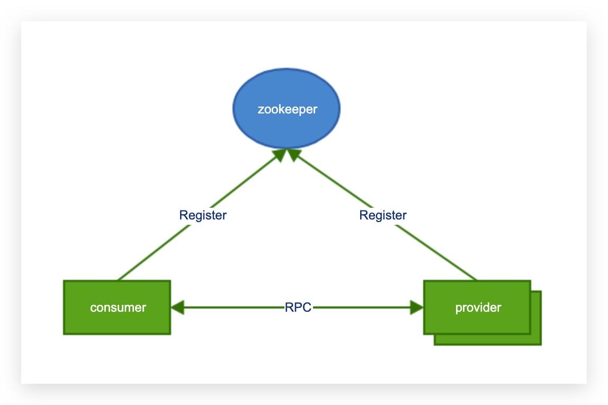
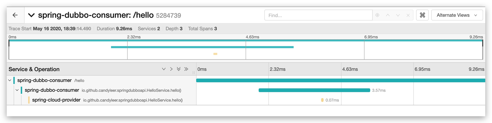

# spring-dubbo-example

链路追踪

## Build
```bash
mvn clean package -DskipTests
```
## Change Log
 * v3 提供了参数控制 开启和关闭监控的能力。
 * v2 提供 prometheus 和 tracing 功能.
 * v1 默认版本。

## Docker Build
```bash
docker build -t candyleer/spring-dubbo-provider:v3 -f spring-dubbo-provider/Dockerfile  ./spring-dubbo-provider/
docker build -t candyleer/spring-dubbo-consumer:v3 -f spring-dubbo-consumer/Dockerfile  ./spring-dubbo-consumer/

```

## Docker Push
```bash
docker push candyleer/spring-dubbo-provider:v3
docker push candyleer/spring-dubbo-consumer:v3
```

## Deploy
```bash
# 部署 jaeger
kubectl apply -f deploy/jaeger-all-in-one-template.yml
# 部署 zookeeper 3个节点
kubectl apply -f deploy/zookeeper.yaml
# 部署 provider 5个节点
kubectl apply -f deploy/provider.yaml
# 部署 consumer 一个节点
kubectl apply -f deploy/consumer.yaml

访问 http://<consumer pod ip>:8080/hello 测试是否通
```
## Monitor (Prometheus and Jaeger tracing)

`--dubbo.monitor.skip=false` 默认开启 prometheus 和 tracing 监控，如果需要关闭，则设置为 true

参数可以在 deployment 中修改。
#### Prometheus 
```bash
#路径
/actuator/prometheus

# 提供方的监控指标
# HELP dubbo_provider_seconds  
# TYPE dubbo_provider_seconds summary
dubbo_provider_seconds_count{method="hello",service="io.github.candyleer.springdubboapi.HelloService",} 21.0
dubbo_provider_seconds_sum{method="hello",service="io.github.candyleer.springdubboapi.HelloService",} 0.157680316
# HELP dubbo_provider_seconds_max  
# TYPE dubbo_provider_seconds_max gauge
dubbo_provider_seconds_max{method="hello",service="io.github.candyleer.springdubboapi.HelloService",} 0.077624181


#消费方的指标
# HELP dubbo_consumer_seconds_max  
# TYPE dubbo_consumer_seconds_max gauge
dubbo_consumer_seconds_max{method="hello",service="io.github.candyleer.springdubboapi.HelloService",} 0.334864448
# HELP dubbo_consumer_seconds  
# TYPE dubbo_consumer_seconds summary
dubbo_consumer_seconds_count{method="hello",service="io.github.candyleer.springdubboapi.HelloService",} 21.0
dubbo_consumer_seconds_sum{method="hello",service="io.github.candyleer.springdubboapi.HelloService",} 0.69077555

```

#### Jaeger Tracing

可以通过启动参数控制采样率，目前提供的参数有：

`--jaeger.agent.sampler.ratio=1` 控制 tracing 的采样率，有效值 0-1，只在监控开启（即`--dubbo.monitor.skip=false`）的时候有效。

